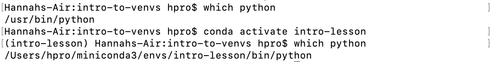
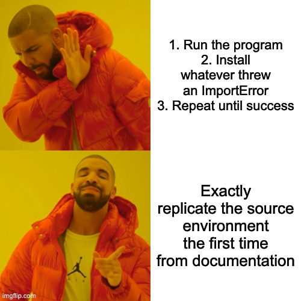

Learning about virtual environments with conda
#### Background information
* The standard package manager in python is pip (Pip Installs Packages)
* The standard central repository for python packages is PyPI (Python Package Index)

## What's wrong with just using one Python installation for everything?
#### It's a pain to use different versions of Python for different projects.
You *could* install another version of python and add it to your path.  Then what happens when you use pip?  You can't really be sure without additional information.  You'd have to know which version of python is first on your path, and maybe specify the whole path to the python you want to use to be sure.

#### Collisions between different projects that depend on conflicting versions of the same package.
Python can't handle this situation on its own.  If ProjectA requires basicpackage 2.0 and ProjectB requires basicpackage 3.0, you're out of luck, they can't both exist on the same python.  Pip will silently replace the old version. 

#### No way to document dependencies for other users.
You can look at every file for the import statements and make a list. Or, you can `pip freeze > requirements.txt`, but that will export a list of every package you've ever installed, not just the ones you need.  Usually, your users are on their own.

_What if there were a better way?_

## Enter the Virtual Environment!
#### What is a virtual environment?
* A virtual environment is a way to easily create a fresh python installation for your project.  Each one can have its own packages with whatever versions it needs.


#### Why should I use one?
It is Best Practice<sup>TM</sup> to have a separate virtual environment for every project you work on because:
* It becomes trivial to guarantee that every place you use python (your terminal, IDE debugger and terminal, etc) is using the same python installation.
* Isolate dependencies between projects to prevent version conflicts.
* Makes environments and imports easy to document and easy to replicate.
* That means experimental results are replicable too.

#### How does it work?
* A virtual environment creates a new Python installation directory. 
* In the bin/ subdirectory, it has hardlinks to the binaries of another, "base" Python installation directory.
* It points to its *own* `pkgs` or equivalent directories where packages can be installed.
* When we activate a virtual environment, it sets your environment variables to point to the new, hardlinked python.
* When we deactivate it, everything goes back to how it was before.

There are several packages that allow for creating python virtual environments (the default venv is good and easy to use) but my favorite is...
## Conda
* Conda is an open-source python version manager *and* package manager *and* environment manager that runs on Windows, macOS and Linux.
* Conda easily creates, saves, loads and switches between environments on your local computer.
* It was created for Python data scientists (and that's where it is most popular), but it can theoretically package and distribute software for any language (whereas pip and PyPI are only for python packages).
* It has better dependency conflict resolution than pip
    - Pip will install a package that breaks your code (or, worse, silently makes it impossible to replicate your results).
    - Conda will find a way to choose compatible versions or tell you if you've asked for the impossible.
* Some of conda's data science libraries are optimized with the Intel Math Kernel Library for faster training.

# Sounds great, how do I get started?

##  Installing Conda
Download conda and add it to your environment.
```
wget https://repo.continuum.io/miniconda/Miniconda3-latest-Linux-x86_64.sh
chmod +x Miniconda3-latest-Linux-x86_64.sh
./Miniconda3-latest-Linux-x86_64.sh
source ~/.bashrc
```
When prompted about running `conda init`, select yes.

## Creating an Environment
* `conda create -n [name]` The base command.
* `-n` specifies the name of my new environment.
    * The environment will be located at `~/miniconda/envs/[name]`.
    * If you would prefer you can instead specify a path to the environment with `-p /prefix/for/env/location`, but then you will have to use the whole prefix to activate it in the future.
* `python=x.x` Specifying a python version is optional.
* `packagename=x.x` Immediately install packagename to the environment, downloading it if you don't have it.  Specifying a version is optional; if not specified conda will choose the most recent version that is compatible with your other dependencies.

Typical fully-loaded example:
```
conda create -n my-new-env python=3.6 scipy=0.15.0 astroid babel
```

## Activating and Deactivating an Environment

It could not be easier!
* Get a list of available environments with `conda env list`.



No more worrying about which python installation to use:  Just run `python my_script.py` and the python of your active environment will be used to run it.

When you're done working on your project, turn off the current virtual environment with `conda deactivate`.


## Installing More Packages
* See the packages you already have with co
* Find available packages with:
```
conda search scikit-learn
```
* With your environment activated, run:
```
conda install scikit-learn=0.24.1
```
* Specifying a version is optional.
* Despite the warnings about pip's dependency resolution issues above, you can still use pip from within a conda environment, so you're not limited to only Anaconda packages.


## Documentation

* You can add environment variables to your virtual environment with 
    ```
    conda env config vars set my_var=value
    ```
* When your code is ready, run:
    ```
    conda env export > environment.yml
    ```
* You can include the --from-history option to only specify the packages you installed manually.
* Include the `environment.yml` file in your git repository for future users of your code.  Here's a sample environment.yaml:
```
name: env-name
channels:
  - conda-forge
  - defaults
dependencies:
  - python=3.7
  - codecov
variables:
  VAR1: valueA
  VAR2: valueB
 ```
 
* To create a new environment from an environment.yml file:
    ```
    conda env create -n my-env-from-file -f environment.yml
    ```

## Delivering Environments
Conda-pack is a command line tool that archives a conda environment, which includes all the binaries of the packages installed in the environment.  This is useful when you want to reproduce an environment with limited or no internet access.
* Requirements:  Source and target machines are of the same OS type (Mac/Linux/Windows) and source has a miniconda installation.
* Activate the base environment so that the package will be available to all sub-environments, then install conda-pack with:
```
conda install -c conda-forge conda-pack
```
* `-c conda-forge` specifies that the package comes from the conda-forge channel instead of the main Anaconda repository.
    
* Pack the environment with
```
conda pack -n my-env-for-customer
```
* I made one as a test: the simple environment was 87MB as a tar.gz.
* Deliver to the .tar.tgz file to the target computer.  In the target's miniconda envs directory, create a new directory for your new env.  Activate the new environment, unpack it, and deactivate it with:
```
cd /dir/to/miniconda3/envs/my_env
source my_env/bin/activate
conda-unpack
source my_env/bin/deactivate
```

### I've heard of conda, Anaconda, and Miniconda.  What's the difference?
* Conda is the package and environment manager software.
* Anaconda and Miniconda are both distributions.  They both have conda and a python installation that is used as the base.
* Miniconda comes with a minimal python installation and the conda package and environment manager.
* Anaconda is a metapackage of 160 data science packages (numpy, scipy, pandas, etc).
* If you have Miniconda, you can install all the Anaconda packages with
    ```
    conda install anaconda
    ```

### Conda sounds great, are there literally any downsides?
* Publishing your own package to PyPI is trivial, but publishing to a conda repository is more of an involved process (you have to build binaries for all supported OSes instead of just uploading the code).
* It's not part of core python: the default package for this functionality is venv.
* Outside of the data science world, some people find that conda is overkill for pure python projects.*
* A basic miniconda environment takes more disk space than a venv one.
* Conda's dependency resolution is better, but does take a little longer.

<sub>\* I think they're biased against its data science reputation and have never had a problem with a conda environment, even when working on non-data science code.</sub>
